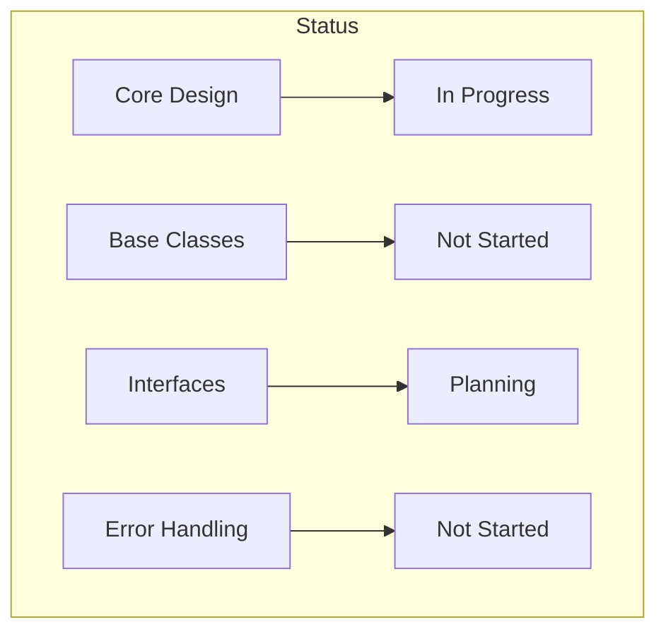

# Project Progress

## Overall Status
🟡 Project is in initial setup phase

## Completed Items
✅ Project initialization
✅ Memory bank setup
✅ Initial architecture design
✅ Core design patterns selected
✅ Technical requirements defined

## In Progress
🔄 Project structure setup
🔄 Core interface definition
🔄 Base adapter design

## Up Next
⏳ Base class implementation
⏳ Error handling framework
⏳ Testing infrastructure
⏳ PubMed adapter implementation

## Component Status

### Core Architecture

### API Integrations
| Source   | Status      | Priority |
|----------|-------------|----------|
| PubMed   | Planning    | 1        |
| MedGen   | Not Started | 2        |
| arXiv    | Not Started | 3        |
| ClinVar  | Not Started | 4        |
| CrossRef | Not Started | 5        |

### Infrastructure Components
| Component        | Status      | Notes                    |
|-----------------|-------------|--------------------------|
| Testing         | Not Started | Framework selection done |
| Documentation   | In Progress | Memory bank initialized  |
| Error Handling  | Planning    | Hierarchy designed       |
| Caching         | Not Started | Strategy defined         |
| Rate Limiting   | Not Started | Requirements gathered    |

## Milestones

### Phase 1: Foundation
- [x] Project initialization
- [x] Architecture design
- [x] Technical planning
- [ ] Core structure implementation
- [ ] Base interface definition

### Phase 2: Core Implementation
- [ ] Base adapter implementation
- [ ] Error handling framework
- [ ] Testing infrastructure
- [ ] Documentation system
- [ ] CI/CD setup

### Phase 3: API Integration
- [ ] PubMed adapter
- [ ] Integration tests
- [ ] Rate limiting
- [ ] Caching system
- [ ] Error recovery

### Phase 4: Expansion
- [ ] Additional adapters
- [ ] Performance optimization
- [ ] Documentation completion
- [ ] Example implementations
- [ ] Release preparation

## Known Issues
- None currently tracked

## Risks and Mitigation

### Technical Risks
1. API Rate Limiting
   - Status: To be addressed
   - Mitigation: Implement robust rate limiting

2. Cross-Source Data Consistency
   - Status: Design phase
   - Mitigation: Standardized data models

3. Performance at Scale
   - Status: To be evaluated
   - Mitigation: Cache-first approach

## Next Actions
1. Implement base class structure
2. Set up testing framework
3. Create first adapter (PubMed)
4. Implement error handling
5. Add basic documentation

## Future Considerations
- Performance optimization
- Additional data sources
- Advanced caching strategies
- Batch processing capabilities
- API versioning support
