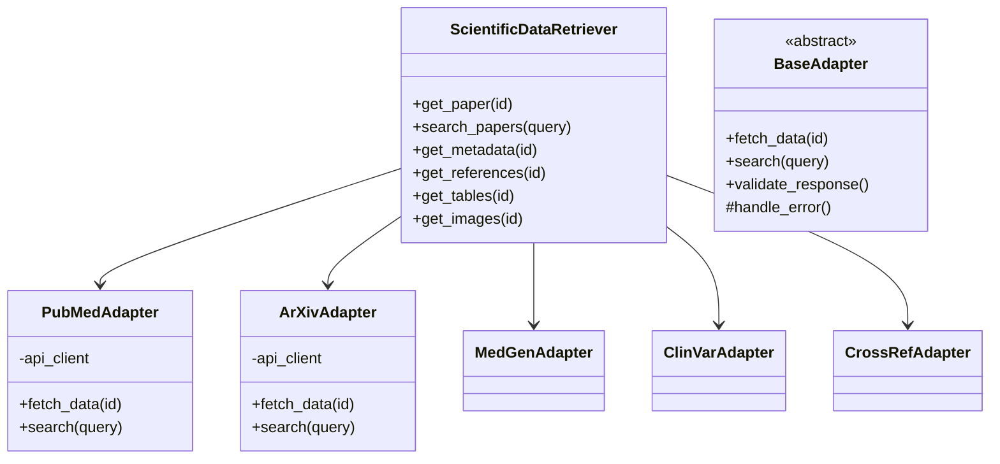
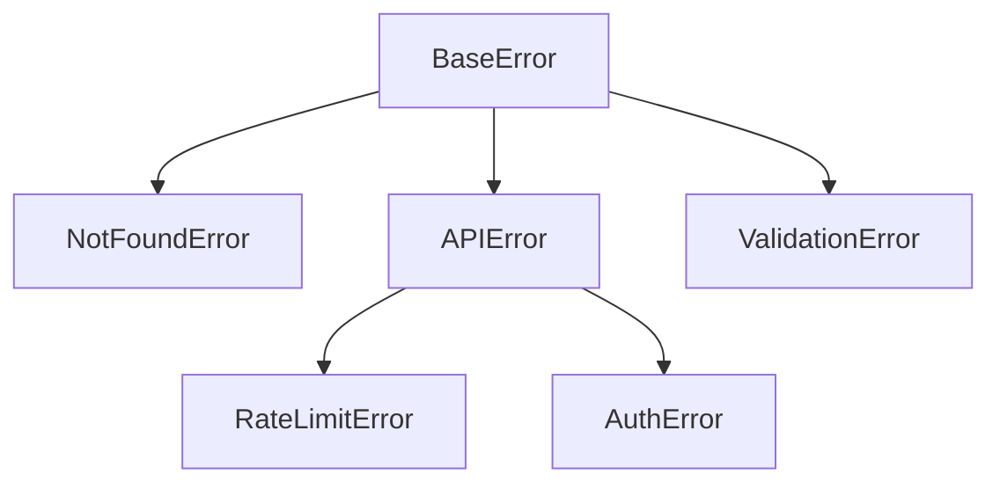
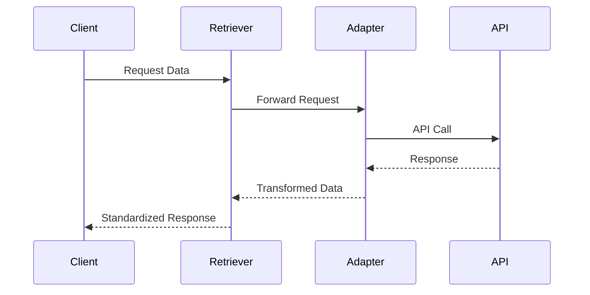

# System Patterns

## Architecture Overview

## Design Patterns

### 1. Adapter Pattern
- Each data source has a dedicated adapter
- Standardizes interactions with different APIs
- Handles source-specific data transformation
- Implements common interface for all sources

### 2. Factory Pattern
- Creates appropriate adapters
- Manages adapter instantiation
- Handles configuration injection
- Supports easy addition of new sources

### 3. Strategy Pattern
- Flexible query building
- Configurable data extraction
- Pluggable authentication methods
- Customizable error handling

### 4. Observer Pattern
- Rate limiting monitoring
- Cache invalidation
- Error reporting
- Progress tracking

## Component Structure

### Core Components
1. Main Interface (ScientificDataRetriever)
   - High-level API
   - Request coordination
   - Response aggregation
   - Error management

2. Data Source Adapters
   - API communication
   - Data transformation
   - Error handling
   - Rate limiting

3. Data Models
   - Paper representation
   - Metadata structure
   - Reference mapping
   - Media content

4. Utility Services
   - Cache management
   - Rate limiting
   - Logging
   - Error handling

## Error Handling

### Hierarchy

### Strategy
1. Source-specific errors converted to standard format
2. Detailed error context preserved
3. Retry mechanisms for transient failures
4. Graceful degradation support

## Data Flow

## Testing Strategy

### Levels
1. Unit Tests
   - Individual adapters
   - Data transformations
   - Error handling

2. Integration Tests
   - API interactions
   - Cross-source operations
   - Error scenarios

3. System Tests
   - End-to-end workflows
   - Performance metrics
   - Reliability checks

## Performance Considerations

### Optimization Strategies
1. Request Batching
2. Response Caching
3. Connection Pooling
4. Rate Limit Management
5. Async Operations

### Monitoring Points
1. Response Times
2. Error Rates
3. Cache Hit Ratios
4. API Usage Metrics
